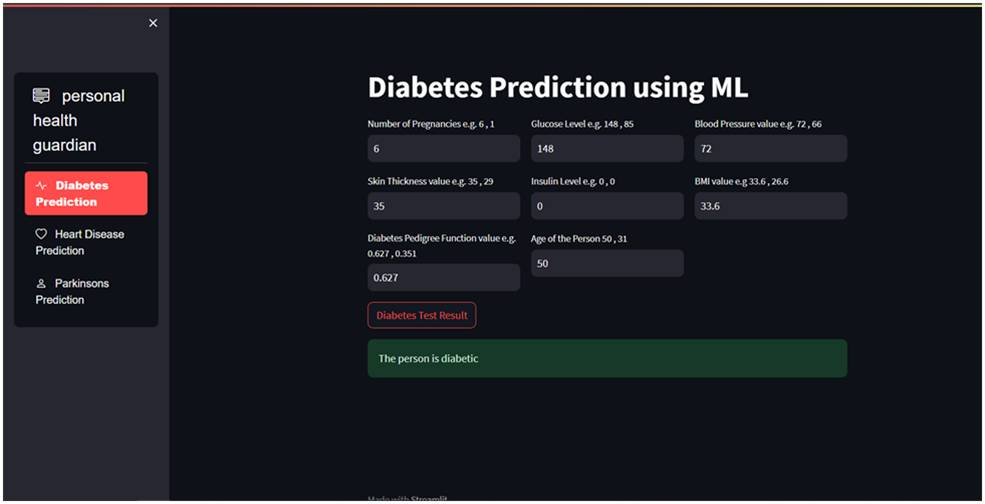
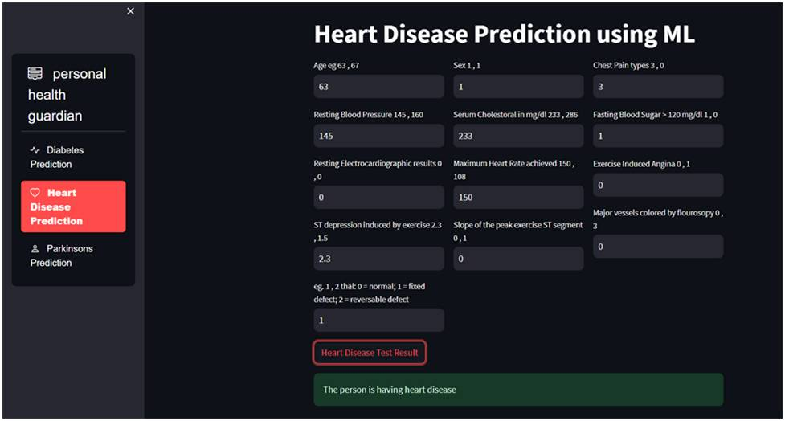
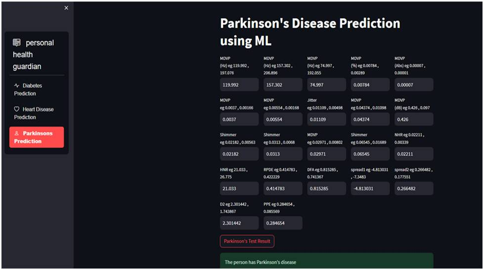

# Multiple Disease Prediction System

## Introduction

This repository contains a project focused on building a smart prediction system capable of identifying the risk of multiple diseases based on user-provided input data. By utilizing machine learning techniques, the system detects patterns within the data and generates insightful predictions to support healthcare decisions.

With the growing importance of early diagnosis in modern medicine, this system aims to enhance clinical decision-making by offering a reliable, automated tool for predicting disease likelihood. It serves as a helpful aid for healthcare professionals in diagnosing conditions and planning effective treatment strategies.

## Features

The Multiple Disease Prediction System offers the following features:

### 1. Data Collection and Preprocessing

- **Data Loading:** Load raw data from diverse sources and formats.
- **Data Cleaning:** Process and clean data to handle missing values and outliers.
- **Data Transformation:** Transform data into suitable formats for analysis.

### 2. Feature Extraction and Selection

- **Feature Engineering:** Create new informative features from existing ones.
- **Feature Selection:** Identify and select the most relevant features for prediction.

### 3. Model Training and Evaluation

- **Machine Learning Models:** Utilize various algorithms such as SVM, Logistic Regression, and Gradient Boosting for training.
- **Model Evaluation:** Evaluate models using metrics like accuracy, precision, recall, and F1-score.
- **Hyperparameter Tuning:** Optimize model parameters to improve performance.

### 4. Predictive System Development

- **User Interface:** Develop a user-friendly interface for interacting with the predictive system.
- **Real-time Prediction:** Provide real-time predictions based on user input data.
- **Result Visualization:** Visualize prediction results and model performance metrics.

## Technologies Used

- Python
- Scikit-learn
- Pandas
- Matplotlib
- Seaborn

## Screenshots

Diabetes Output

Heart Output

Parkinson's Output

## Getting Started

To get started with the Multiple Disease Prediction System:

1. Clone this repository using the command:

git clone https://github.com/Aadix07/Multiple-Disease-Prediction-System.git

Copy code

2. Install the required dependencies by running:

pip install -r requirements.txt

3. Follow the usage instructions provided in the repository to preprocess data, train models, and utilize the predictive system.

